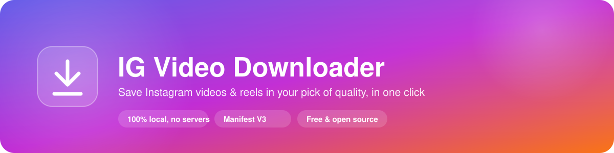
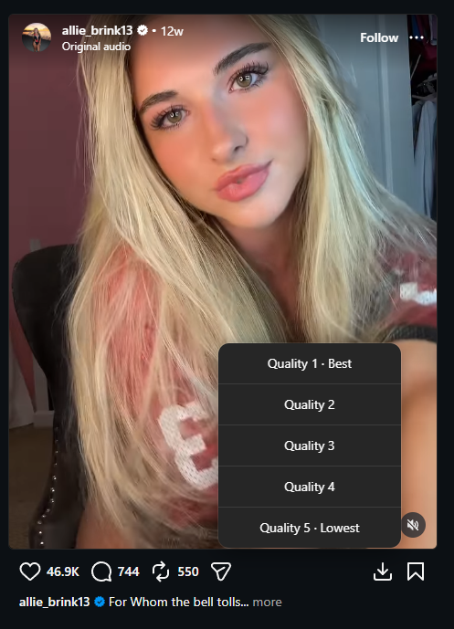
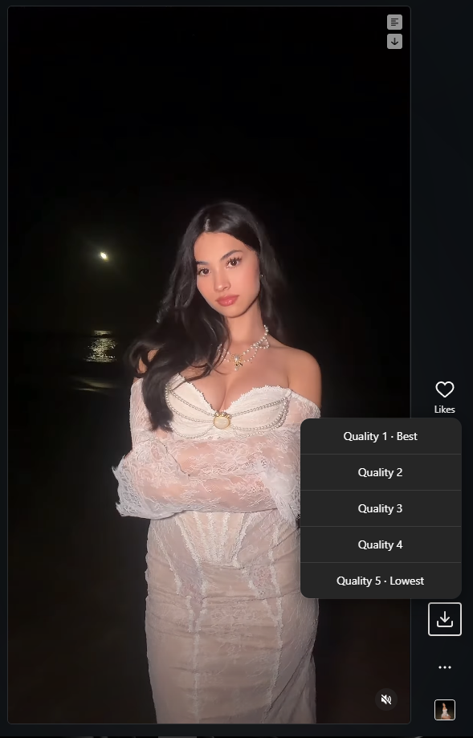

  

  A Chrome extension that adds a download button right next to Instagram's own <b>Save</b> icon —
  pick a quality, click, done. No sketchy third-party site, no watermark, no uploading anything anywhere.

  
  
  

## Why

Every "Instagram downloader" site wants you to paste a link into a page full of ads, and half of them quietly re-encode or watermark the video. This is the opposite: it's a few hundred lines of JavaScript that runs entirely in your own browser, using your own logged-in session, and never talks to any server but Instagram's. You can read the whole thing in a few minutes — see [How it works](#how-it-works).

## Features

- 📥 **One click, right where you'd expect it** — a download icon appears next to Save on every video post, reel, and IGTV video.
- 🎚️ **Pick your quality** — a small popover lists every resolution Instagram gives you, best to worst, so you're not stuck with whatever the page happened to preload.
- 🧭 **Works everywhere on the site** — home feed, explore, profile grids, single post pages, and the Reels tab, including as you scroll.
- 🌓 **Matches the page** — the icon and popover pick up Instagram's own light/dark theme automatically.
- 🔒 **Fully local** — no accounts, no API keys, no analytics, no external server. Everything happens in-browser with your own session.

## Screenshots

  
  

## Install (unpacked, for local/dev use)

This isn't on the Chrome Web Store, so it's loaded as an unpacked extension — completely normal for a small personal-use tool, takes under a minute:

1. Download this repository (**Code → Download ZIP**, then unzip it — or `git clone` if you'd rather).
2. Open `chrome://extensions` (works the same in Brave, Edge, and other Chromium browsers — just swap the scheme, e.g. `brave://extensions`).
3. Turn on **Developer mode** (top right).
4. Click **Load unpacked** and select the folder you unzipped/cloned.
5. Open Instagram and refresh the tab. Wherever you see a **Save** (bookmark) icon on a video, a download icon now sits right next to it.

That's it — no build step, no `npm install`. It's plain JS/HTML/CSS.

### Updating

Since it's unpacked, updates aren't automatic: `git pull` (or re-download the ZIP), then click the reload icon on the extension's card in `chrome://extensions`, and refresh any open Instagram tabs.

## How it works

- Runs across all of `instagram.com` — home feed, explore, profile, reels tab, and single post/reel/tv pages — since Instagram is a single-page app and content renders in-place without a full page navigation.
- It watches the page for Instagram's native bookmark-shaped **Save** icon (present on every post/reel with an attached video) and injects a matching download icon right next to it, matching that icon's own color so it blends into both themes.
- Clicking it resolves the specific post's shortcode — from the on-screen permalink closest to what you clicked, or the current URL on a single post/reel page — then looks for that post's video data in a few steps, since Instagram doesn't expose it the same way twice:
  1. **A real network response**, tapped as Instagram's own client fetches it while you scroll — the only reliable source once you've scrolled past whatever was on the page when it first loaded.
  2. **Whatever's already hydrated into the current page's DOM**, for whatever's actually rendered on screen right now.
  3. **A fresh fetch of the post's own page**, for post types Instagram happens to server-render with video data included.
  4. **The real network requests already made to play the video**, as a last resort — only ever the video actually playing in the container you clicked, never guessed from an unrelated post.
- A small popover, styled after Instagram's own dropdown menus, lists the available qualities from best to worst. Click one and it downloads immediately through the browser's native downloads API — no server round-trip.

## Notes / limitations

- Only appears next to posts/reels that have a video — image-only posts aren't handled.
- For carousel posts with multiple video slides, all detected video variants across slides are listed together; quality options aren't currently grouped per slide.
- Instagram doesn't always expose real width/height per variant (reels in particular only tag each URL with an opaque type), so options sometimes show as "Quality 1", "Quality 2", etc. in the order Instagram returned them (best-first) rather than an actual resolution.
- Some posts only have one distinct video file behind all listed variants — seeing a single quality option in that case is correct, not a bug.
- If Instagram changes its DOM structure or the Save icon's `aria-label`, icon injection may stop working until this is updated.

## Disclaimer

Downloading content you don't own or don't have the rights to redistribute may violate Instagram's Terms of Service. Use this for personal archival of your own content, or content you have permission to save.
